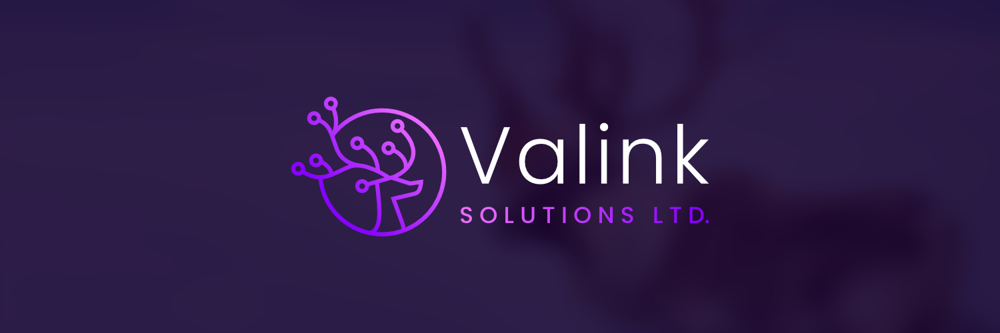

In the ever changing world of technology, evolution is not a choice, but a necessity. It's about sticking true to your roots while embracing the future. At Valink Solutions, we recently embarked on a transformative journy, that not only encapsulates our traditions but also focuses on our commitment to merging technology with those traditions and our commitment to innovation and community empowerment.

Our journey started with introspection. We realized that our old logo and branding was not reflective of what we represent and what drives us to do what we do. We wanted to create something that would truley represent us and our values and what we strive for, something that represented our history and our future. The result? A symbol that we believe speaks volumes.

This symbol holds profound significance, as it is a representation of our past, present, and future. It is a testament to our commitment to preserving and honoring our indigenous roots, while simultaneously embracing the changing dynamics of the digital landscape. The caribou pays homage to the tribal heritage of our founder, anchoring us to our rich indigenous culture. The antlers of the caribou are a beautiful fusion of circuits to symbolize the mixing of technology and tradition. The caribou is facing to the right to show that we are always striving towards a better future.

Why purple? For us, a colour has to also have meaning and in our eyes purple is a statement. Purple signifies creativity, wisdom and dignity. Our purple is a statement of our commitment to preserving and honoring our indigenous roots, while simultaneously embracing the changing dynamics of the digital landscape.

We also updating our design system on our website to reflect our new branding, updading the colours to our new purple and green, as well as removing our old neubrutalism design system as this was perfect for our product [ChunkVault](https://chunkvault.com) but not for our brand. Gone is the blocky and neubrutalistic design system, now we have a more modern and minimalist design system that reflects our new branding.

This is just the beginning of our journey, we are still working on our branding and marketing strategy, but we are already seeing the results of our commitment to preserving and honoring our indigenous roots. This rebrading marks a new chapter fueled by innovation, guided by our traditions and driven by a relentless passion for brining a positive change. Join us as we continue to push boundaries, break new ground and build a future where technology not just serves the few, but the many.
